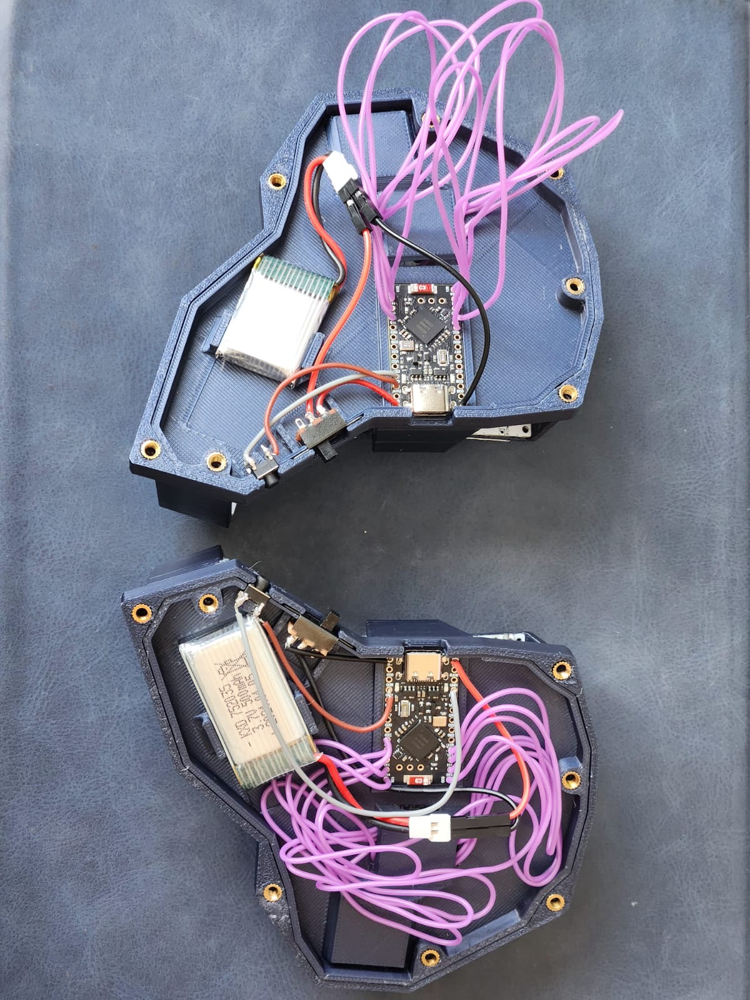

# Choc Diamond

### A 24 keys handwired split keyboard.

## Some build pictures:

PCBs connected

Components under the covers

Components wired

PCBs wired

Cable management under the covers

Final build

