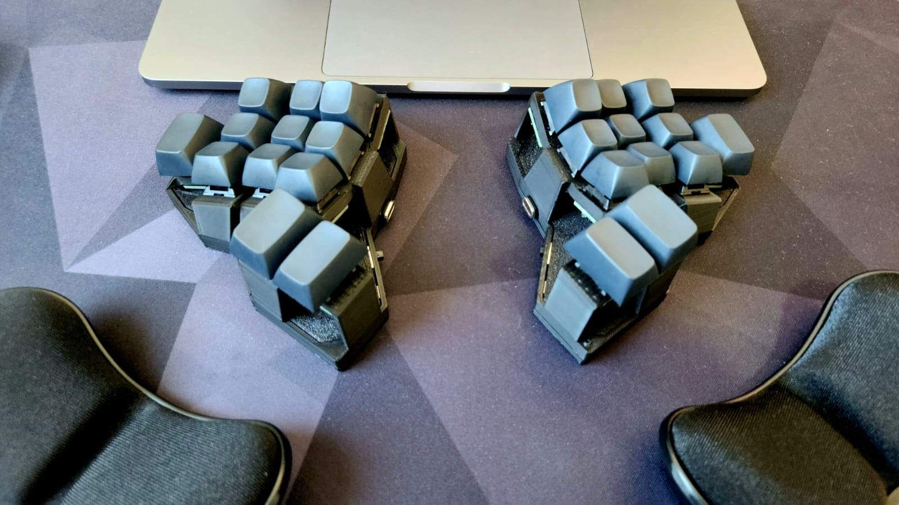
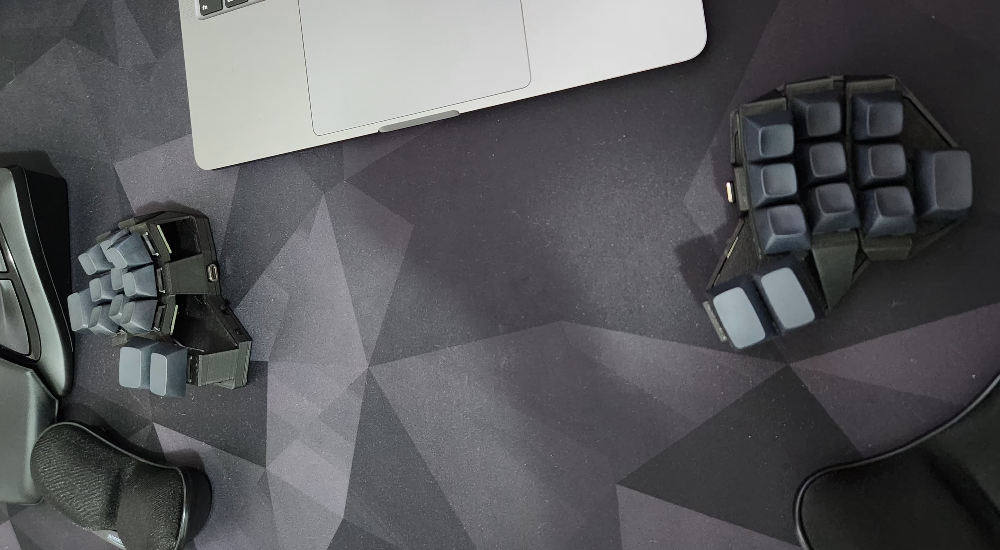

# Diamond
### A 24 keys handwired split keyboard.

## Some build pictures:

Right Side - PCBs before wiring

Left Side - Components detail

Left Side - Components wired

Right Side - Wiring complete

Left Side - Cover and Base

Left Side - Cable Management

Back View

Inner Side View

Outer Side View

Top View

Bottom View

Final Build

Final build

