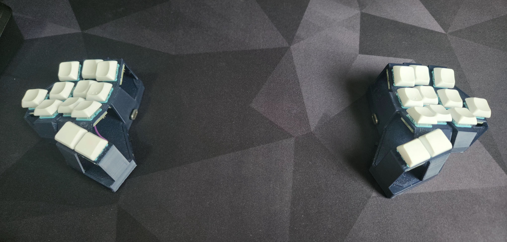

# Diamond

## A 24 keys handwired split keyboard.

Diamond is a handwired board originally designed by me but heavily inspired by the [Rommana](https://github.com/AlaaSaadAbdo/Rommana) and using the switch holders of the [Dactyl Cygnus](https://github.com/juhakaup/keyboards).
- It contains 24 keys only, in the format 1333+2.
- It should be handwired, ideally using single switch PCBs.
- The MCU, reset button and on/off switch goes in the base, below a cover used to hide them.
- These components should be mounted upside down, under this cover.
- The cables for column and rows will pass through 3 holes in the cover and can be tightened in the end of assembling to make them less visible in the final build. 

# Diamond Builds

## [Diamond](builds/diamond/diamond.md)

## [Wired Diamond](builds/wired_diamond/wired_diamond.md)

## [Choc Diamond](builds/choc_diamond/choc_diamond.md)

# STL Files

The STL files are provided for the right side only. To print the left side you will have to mirror them.

- [Base Right](stls/v2/base_right.stl)
- [Cover Right](stls/v2/cover_right.stl)
- [MX Body Right](stls/v2/body_right.stl)
- [MX Body Right - Tilted Thumbs](stls/v2/body_right_tilted.stl)
- [Choc Body Right](stls/v2/choc_body_right.stl)
- [Choc Body Right - Tilted Thumbs](stls/v2/choc_body_right_tilted.stl)
- [Unibody Base](stls/v2/unibody_base.stl)
- [Unibody Base Cover](stls/v2/unibody_base_cover.stl)

# Firmware

Check my [keyboards](https://github.com/rafaelromao/keyboards) repo to find the ZMK firmware for these boards.